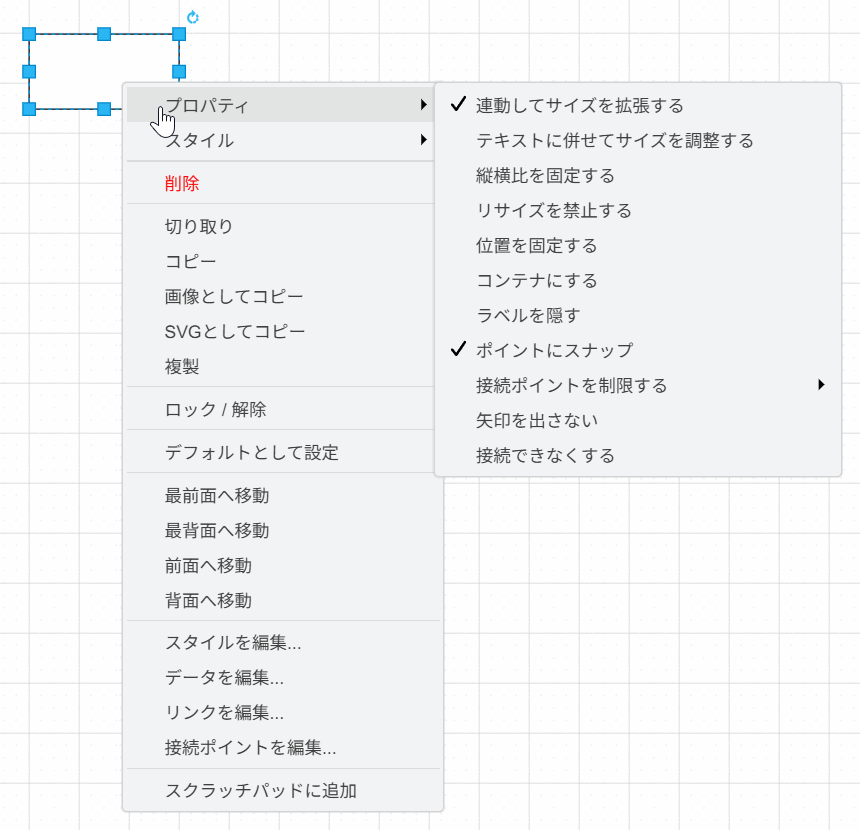

# draw.io Plugins Collection

draw.io (diagrams.net) の機能を拡張する便利なプラグインの詰め合わせリポジトリです。

---

## 1. draw.io Quick Styler Plugin (`quick-styler.js`)

図形のプロパティ切替とスタイルの保存・適用を、右クリックメニューから行えるプラグインです。



### 概要

2 つのメニューを提供します。

**プロパティ** - 選択図形のプロパティを 1 クリックで ON/OFF 切替
- チェックマーク付きで現在の状態を表示
- 一部のプロパティはサブメニューでプリセット選択（接続ポイント制限など）

**スタイル** - スタイルの保存・適用・削除
- 選択図形の明示設定されたスタイル（塗りつぶし、枠線、テキスト、配置など）を名前付きで保存
- 保存したスタイルを別の図形に一括適用
- 保存先は `localStorage`
- ダイアログからドロップダウンでスタイルを選択し、保存・削除が可能

### 使い方

1. 図形を右クリック → **「プロパティ」** から各項目を ON/OFF 切替
2. 図形を右クリック → **「スタイル」** → **「スタイルを管理」** で保存・削除ダイアログを表示
3. 保存済みスタイル名をクリックで選択図形に一括適用

### 設定とカスタマイズ
本プラグインの設定は [quick-styler.js](quick-styler.js) の `CONFIG.menus` 配列に直接記述されています。

プロパティの追加・編集を行う場合は、[quick-styler.js](quick-styler.js) を直接開いて `CONFIG.menus` 内の `properties` 配列を書き換えてください。

#### プロパティメニュー（標準では以下が登録）

| プロパティ名 | キー (`key`) | デフォルト値 (未設定時) |
| :--- | :--- | :--- |
| 連動してサイズを拡張する | `expand` | ON |
| テキストに併せてサイズを調整する | `autosize` | OFF (`defaultOff: true`) |
| 縦横比を固定する | `aspect` | OFF (`defaultOff: true`) |
| リサイズを禁止する | `resizable` | OFF (`defaultOff: true`) |
| 位置を固定する | `movable` | OFF (`defaultOff: true`) |
| コンテナにする | `container` | OFF (`defaultOff: true`) |
| ラベルを隠す | `noLabel` | OFF (`defaultOff: true`) |
| ポイントにスナップ | `snapToPoint` | ON |
| 接続ポイントを制限する | `constraintPoints` | サブメニュー (上下左右/左右/上下/なし) |
| 矢印を出さない | `allowArrows` | OFF (`defaultOff: true`) |
| 接続できなくする | `connectable` | OFF (`defaultOff: true`) |

#### スタイルメニュー
- **スタイルを管理**: 選択図形の明示設定されたスタイル値を名前付きで保存。ダイアログから保存・削除が可能。
- **保存済みスタイル一覧**: クリックで選択図形に一括適用。

---

## 2. draw.io Hierarchy Viewer Plugin (`hierarchy-viewer.js`)

図面内のオブジェクト（セル）の親子関係（グループ構造）および前後関係（Zオーダー/重なり順）を一覧表示し、双方向で選択同期できるフローティングウィンドウを追加するプラグインです。


### 概要
複雑な図面で図形がグループ化されていたり、重なり合っている場合に、それらの構造をツリー表示で可視化します。
- **親子関係の可視化**: グループ化された階層構造をツリー表示します。
- **前後関係の可視化**: 親要素の中で、背面にあるものほど下、前面にあるものほど上に並びます。各要素の横に重なり順のインデックス（`Z: インデックス / 最大インデックス`）が表示されます。
- **選択同期**: ツリー内のアイテムをクリックすると、エディタ上で対応する図形が選択状態になり、表示位置に自動スクロールします。また、エディタ側で図形を選択した際にも、ツリー上の該当項目が自動的にハイライトされます。
- **表示・非表示（可視性）の切り替え**:
  - 各項目の左側にある目のアイコン（開いた目: 表示 / 斜線付きの目: 非表示）をクリックすることで、図面上のオブジェクトの可視状態をトグルできます（エディタの変更履歴と連動しており、Undo/Redoが可能です）。
- **ドラッグ＆ドロップによる階層・順序の入れ替え**:
  - ツリー上の各項目の左側にある **ドラッグハンドル（`⋮⋮`）** をドラッグし、別のオブジェクトの上にドロップすることで親子関係（グループ構造）を変更できます。
  - ハンドルをドラッグして他の項目の上辺または下辺付近にドロップすることで、同じ親の配下における前後関係（Zオーダー）を直感的に並べ替えることができます（ドラッグ中、挿入先が青い境界線でプレビューされます）。
- **名前の編集（鉛筆ボタン または F2 キー）**:
  - 各項目の右側にある **鉛筆ボタン（✏️）** をクリックするか、または項目を選択して **`F2` キー** を押すことで、その場でオブジェクト名（レイヤー名も含む）を直接変更できます（インプレース入力欄が表示され、Undo/Redoに対応しています）。

### 使い方
ウィンドウの表示・非表示を切り替えるには、以下のメニューから行います。

* draw.io のメニューバーから **「その他」 (Extras)** または **「表示」 (View)** > **「階層・オブジェクトビューア」** を選択します。
* ウィンドウの位置・サイズ・表示状態は自動的に保存され、次回起動時に復元されます。

表示されたフローティングウィンドウ内のオブジェクトをクリックすると、エディタ上で対応する図形を選択できます。また、左側のドラッグハンドル（`⋮⋮`）をドラッグ＆ドロップすることで「階層・重ね順の変更」、目のアイコン（表示/非表示）で「表示トグル」、鉛筆ボタン（✏️）または **`F2` キー** を押すことで「名前の編集」が可能です。

---

## 3. draw.io Handle Scaler Plugin (`handle-scaler.js`)

頂点（選択時のサイズ変更・回転ハンドル）や、接続ポイント（コネクタ接続用の点）の表示サイズおよび判定サイズを大きくして、高解像度ディスプレイやマウス操作での操作性を向上させるプラグインです。右側がオリジナルの状態で、左側がプラグインを有効にした状態です。


### 概要
draw.io のデフォルトの操作ハンドルや接続ポイントはサイズが小さく（通常 5〜8 ピクセル）、マウス操作での狙い撃ちや、高解像度（4K等）の環境においてクリックしづらい場合があります。
このプラグインを導入すると、以下のサイズ変更と判定の拡張を行います。
- **選択ハンドルの拡大**: 図形選択時に表示されるサイズ変更（リサイズ）用ハンドルおよび回転ハンドルのサイズを大きくします。**ズーム倍率に合わせてリアルタイムに拡大縮小する動的スケール機能付きです（ズーム 100% から 800% にかけて緩やかに最大サイズへと変化します）。**
- **接続ポイントの拡大**: コネクタを接続する際に表示される接続ポイント（点/画像）を拡大表示します。**ズーム倍率に合わせてこちらも動的にスケールします（同様にズーム 100% から 800% にかけて緩やかに変化します）。**
- **接続のホバー判定拡張**: 接続ポイントの判定範囲（許容誤差）を拡大し、少し離れた位置からのドラッグでも接続が吸着しやすくなるよう調整します。**判定範囲もズーム倍率に応じて動的に伸縮します。**

### 設定とカスタマイズ
本プラグインの設定は [handle-scaler.js](handle-scaler.js) の先頭にある `CONFIG` オブジェクトに記述されています。

必要に応じて数値を書き換えてサイズを調整してください。

| 設定項目名 | キー (`key`) | デフォルト値 | 説明 |
| :--- | :--- | :--- | :--- |
| リサイズハンドル | `handleSize` | 10 | 選択した図形の角に表示されるサイズ変更ハンドルの大きさ |
| コネクタ開始点ハンドル | `edgeStartHandleSize` | 26 | 選択したコネクタの開始点ハンドルの大きさ |
| コネクタ中間点ハンドル | `edgeMiddleHandleSize` | 22 | 選択したコネクタの中間点・経路変更ハンドルの大きさ |
| コネクタ終了点ハンドル | `edgeEndHandleSize` | 26 | 選択したコネクタの終了点ハンドルの大きさ |
| ラベルハンドル | `labelHandleSize` | 6 | テキストラベルの移動用ハンドルの大きさ |
| 接続トリガーハンドル | `connectHandleSize` | 10 | 図形選択時に周囲に表示される接続矢印ハンドルの大きさ |
| 接続ポイント画像 | `pointImageSize` | 6 | 図形ホバー時に表示される接続ポイントの大きさ |
| 丸型ハンドル | `roundHandles` | `false` | ハンドルを丸型（円形）にするかどうか |
| ハンドルサイズ下限倍率 | `minHandleScale` | 0.25 | ズーム時のハンドルサイズの下限倍率（初期値の何倍まで縮小するか） |
| ハンドルサイズ上限倍率 | `maxHandleScale` | 4 | ズーム時のハンドルサイズの上限倍率（初期値の何倍まで拡大するか） |
| 接続ポイントサイズ上限倍率 | `maxPointScale` | 2 | ズーム時の接続ポイントサイズの上限倍率（初期値の何倍まで拡大するか） |

---

## 4. draw.io Swap Click/Alt+Click Plugin (`swap-click-alt.js`)

通常の左クリックと Alt+左クリックの transparent click 動作を入れ替えるプラグインです。

### 概要
draw.io では、重なった図形を操作するときに Alt+左クリックで前面オブジェクトをスルーして背面オブジェクトを選択する挙動があります。
本プラグインを導入すると、この操作を入れ替えて、Altキーを押さない通常の左クリックで背面オブジェクトを選択できるようにします。

- **左クリック**: 選択済みの前面オブジェクトをスルーして背面オブジェクトを選択
- **Alt+左クリック**: draw.io 標準の通常クリックとして前面オブジェクトを選択
- **メニュー切替**: **「左クリックとALT+左クリックを入替」** で有効・無効を切替
- **状態保存**: 有効・無効の状態は `localStorage` に保存されます

### 使い方
1. 重なっている前面オブジェクトを選択します。
2. 通常の左クリックで、背面オブジェクトを選択します。
3. 前面オブジェクトを通常通り選択したい場合は、Alt+左クリックします。

メニュー項目は draw.io の **「その他」 (Extras)** または **「表示」 (View)** に追加されます。
初回読み込み時は有効です。メニューから無効化すると、次回以降も無効状態が復元されます。

---

## インストール手順（共通）

各プラグインを適用するには以下の手順を行います。

### 1. プラグインファイルの配置
本リポジトリ内のプラグインファイル（[quick-styler.js](quick-styler.js), [hierarchy-viewer.js](hierarchy-viewer.js), [handle-scaler.js](handle-scaler.js), [swap-click-alt.js](swap-click-alt.js)）をローカルの任意の場所に保存するか、Web サーバー等にホストします。

### 2. draw.io での登録
1. [draw.io](https://app.diagrams.net/) をブラウザで開くか、デスクトップ版を起動します。
   - **※デスクトップ版 (draw.io.exe) を使用する場合の注意:**  
     デスクトップ版でプラグインを有効化するには、コマンドラインやショートカットから `draw.io.exe --enable-plugins` のようにオプションを付与して起動する必要があります。
   - **※Windows デスクトップ版でファイルの関連付け（ダブルクリック）から起動する場合:**  
     ファイルをダブルクリックして開く場合もプラグインを有効にするには、draw.io の `open` コマンドに `--enable-plugins` が含まれている必要があります。また、対象の拡張子（`.drawio` / `.svg` / `.xml` / `.png` など）が draw.io に関連付けられている必要があります。

     **1. 拡張子が draw.io に関連付けられているか確認**

     ```cmd
     reg query HKCR\.drawio /ve
     reg query HKCR\.svg /ve
     ```

     `(既定)` の値が `draw.io Diagram` になっていれば関連付け済みです。空欄や別の ProgID の場合は、以下のいずれかの方法で関連付けます。

     - **方法 A: ユーザー単位（管理者権限不要）**

       ```cmd
       reg add HKCU\Software\Classes\.svg /ve /t REG_SZ /d "draw.io Diagram" /f
       ```

     - **方法 B: システム全体（管理者権限が必要）**

       ```cmd
       reg add "HKLM\Software\Classes\.svg" /ve /t REG_SZ /d "draw.io Diagram" /f
       ```

     ※ `.svg` が他のアプリ（ブラウザや画像ビューア）に関連付けられていた場合、Windows の「設定 → アプリ → 既定のアプリ → ファイルの種類で既定のアプリを選ぶ」から `.svg` を draw.io に手動で変更する必要がある場合もあります。

     **2. open コマンドに `--enable-plugins` が含まれているか確認**

     ```cmd
     reg query "HKCR\draw.io Diagram\shell\open\command" /ve
     ```

     値が次のように `--enable-plugins` なしの場合:

     ```text
     "C:\Program Files\draw.io\draw.io.exe" "%1"
     ```

     次のように変更します。

     ```text
     "C:\Program Files\draw.io\draw.io.exe" --enable-plugins "%1"
     ```

     レジストリの実体はインストール方法により異なります。現在のユーザーだけに設定する場合は `HKCU\Software\Classes\<ProgID>\shell\open\command`、全ユーザー向けインストールの場合は `HKLM\Software\Classes\<ProgID>\shell\open\command` を編集します。`HKCR\<ProgID>\shell\open\command` はこれらを統合した表示です。

     例: ProgID が `draw.io Diagram` で、全ユーザー向けにインストールされている場合:

     ```cmd
     reg add "HKLM\Software\Classes\draw.io Diagram\shell\open\command" /ve /t REG_SZ /d "\"C:\Program Files\draw.io\draw.io.exe\" --enable-plugins \"%1\"" /f
     ```

     `HKLM` を変更する場合は管理者権限が必要です。レジストリを編集する前に、対象キーをエクスポートしてバックアップしておくことを推奨します。
2. メニューバーの **「その他」 (Extras)** > **「プラグイン...」 (Plugins...)** を選択します。
3. ダイアログが表示されたら **「追加」 (Add...)** をクリックします。
4. ファイルのパスを入力し、**「OK」** をクリックします。
5. draw.io を再読み込み（F5キーなど）します。
6. 「プラグインが読み込まれました」という警告が表示されたら **「OK」** をクリックします。
