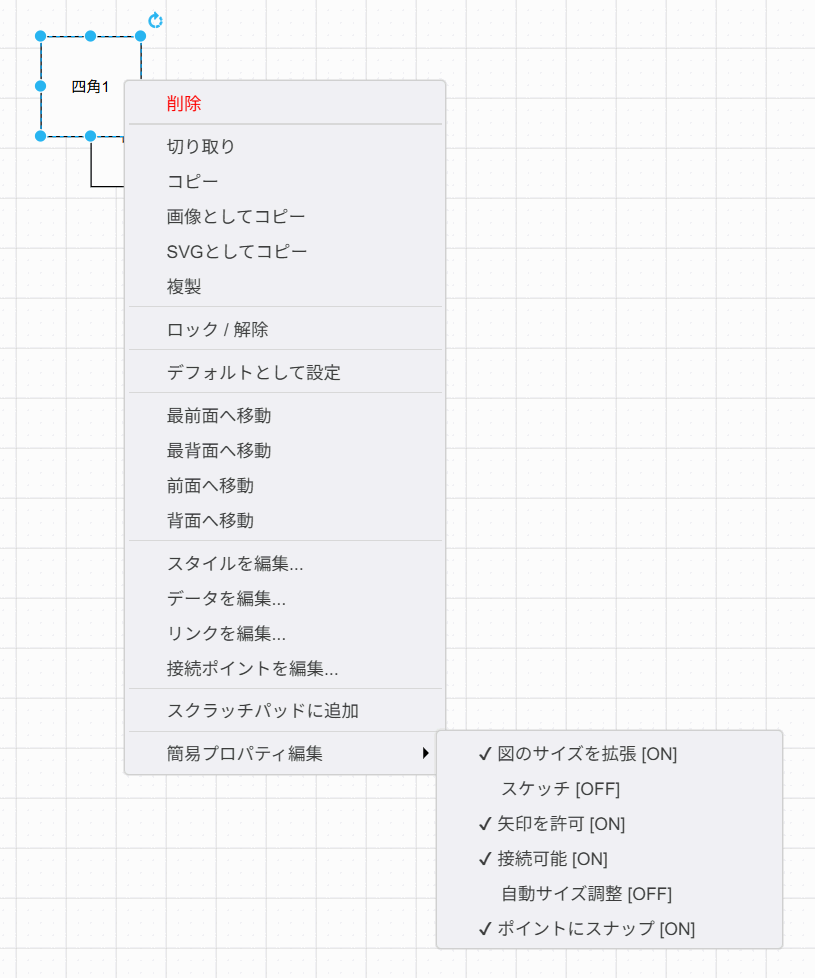
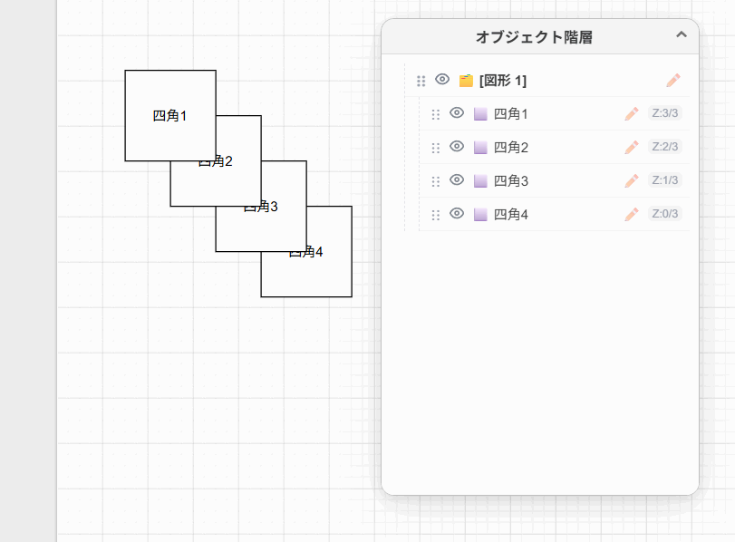
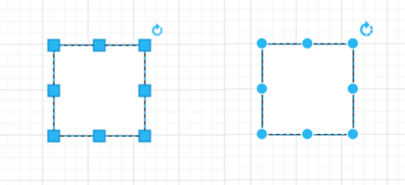

# draw.io Plugins Collection

draw.io (diagrams.net) の機能を拡張する便利なプラグインの詰め合わせリポジトリです。

---

## 1. draw.io Quick Styler Plugin (`quick-styler.js`)

選択した図形のプロパティ（スタイル）を、右クリックのコンテキストメニューから簡単に切り替えられるようにするプラグインです。

### 概要
通常、draw.io で図形のスタイル（「連動してサイズを拡張」「テキストに併せてサイズを調整」「矢印を出さない」など）を変更するには、右側のフォーマットパネルから複数の操作を行う必要があります。
このプラグインを導入すると、図形を右クリックした際のコンテキストメニュー**最上部**から、指定したプロパティの ON/OFF を 1 クリックで切り替えられるようになります。

### 使い方
1. 編集する図形（頂点）を選択します。
2. 選択した図形の上で右クリックします。
3. コンテキストメニュー内の **「プロパティ」** を選択します。
4. 変更したいプロパティをクリックして ON/OFF を切り替えます。
   - 現在 ON の項目にはチェックマーク（✔）が表示されます。

### 設定とカスタマイズ
本プラグインの設定は [quick-styler.js](quick-styler.js) の先頭にある `CONFIG` オブジェクトに直接記述（ハードコード）されています。

プロパティの追加・編集を行う場合は、[quick-styler.js](quick-styler.js) を直接開いて `CONFIG` オブジェクトの内容を書き換えてください。

#### 設定項目の一覧

標準では以下のプロパティが登録されています。

| プロパティ名 | キー (`key`) | デフォルト値 (未設定時) |
| :--- | :--- | :--- |
| 連動してサイズを拡張する | `expand` | ON |
| テキストに併せてサイズを調整する | `autosize` | OFF (`defaultOff: true`) |
| リサイズを禁止する | `resizable` | OFF (`defaultOff: true`) |
| 位置を固定する | `movable` | OFF (`defaultOff: true`) |
| ラベルを隠す | `noLabel` | OFF (`defaultOff: true`) |
| ポイントにスナップ | `snapToPoint` | ON |
| 矢印を出さない | `allowArrows` | OFF (`defaultOff: true`) |
| 接続できなくする | `connectable` | OFF (`defaultOff: true`) |

---

## 2. draw.io Hierarchy Viewer Plugin (`hierarchy-viewer.js`)

図面内のオブジェクト（セル）の親子関係（グループ構造）および前後関係（Zオーダー/重なり順）を一覧表示し、双方向で選択同期できるフローティングウィンドウを追加するプラグインです。

### 概要
複雑な図面で図形がグループ化されていたり、重なり合っている場合に、それらの構造をツリー表示で可視化します。
- **親子関係の可視化**: グループ化された階層構造をツリー表示します。
- **前後関係の可視化**: 親要素の中で、背面にあるものほど下、前面にあるものほど上に並びます。各要素の横に重なり順のインデックス（`Z: インデックス / 最大インデックス`）が表示されます。
- **選択同期**: ツリー内のアイテムをクリックすると、エディタ上で対応する図形が選択状態になり、表示位置に自動スクロールします。また、エディタ側で図形を選択した際にも、ツリー上の該当項目が自動的にハイライトされます。
- **表示・非表示（可視性）の切り替え**:
  - 各項目の左側にある目のアイコン（開いた目: 表示 / 斜線付きの目: 非表示）をクリックすることで、図面上のオブジェクトの可視状態をトグルできます（エディタの変更履歴と連動しており、Undo/Redoが可能です）。
- **ドラッグ＆ドロップによる階層・順序の入れ替え**:
  - ツリー上の各項目の左側にある **ドラッグハンドル（`⋮⋮`）** をドラッグし、別のオブジェクトの上にドロップすることで親子関係（グループ構造）を変更できます。
  - ハンドルをドラッグして他の項目の上辺または下辺付近にドロップすることで、同じ親の配下における前後関係（Zオーダー）を直感的に並べ替えることができます（ドラッグ中、挿入先が青い境界線でプレビューされます）。
- **名前の編集（鉛筆ボタン または F2 キー）**:
  - 各項目の右側にある **鉛筆ボタン（✏️）** をクリックするか、または項目を選択して **`F2` キー** を押すことで、その場でオブジェクト名（レイヤー名も含む）を直接変更できます（インプレース入力欄が表示され、Undo/Redoに対応しています）。

### 使い方
ウィンドウの表示・非表示を切り替えるには、以下のメニューから行います。

* draw.io のメニューバーから **「その他」 (Extras)** または **「表示」 (View)** > **「階層・オブジェクトビューア」** を選択します。

表示されたフローティングウィンドウ内のオブジェクトをクリックすると、エディタ上で対応する図形を選択できます。また、左側のドラッグハンドル（`⋮⋮`）をドラッグ＆ドロップすることで「階層・重ね順の変更」、目のアイコン（表示/非表示）で「表示トグル」、鉛筆ボタン（✏️）または **`F2` キー** を押すことで「名前の編集」が可能です。

---

## 3. draw.io Handle Scaler Plugin (`handle-scaler.js`)

頂点（選択時のサイズ変更・回転ハンドル）や、接続ポイント（コネクタ接続用の点）の表示サイズおよび判定サイズを大きくして、高解像度ディスプレイやマウス操作での操作性を向上させるプラグインです。右側がオリジナルの状態で、左側がプラグインを有効にした状態です。

### 概要
draw.io のデフォルトの操作ハンドルや接続ポイントはサイズが小さく（通常 5〜8 ピクセル）、マウス操作での狙い撃ちや、高解像度（4K等）の環境においてクリックしづらい場合があります。
このプラグインを導入すると、以下のサイズ変更と判定の拡張を行います。
- **選択ハンドルの拡大**: 図形選択時に表示されるサイズ変更（リサイズ）用ハンドルおよび回転ハンドルのサイズを大きくします。**ズーム倍率に合わせてリアルタイムに拡大縮小する動的スケール機能付きです（ズーム 100% から 800% にかけて緩やかに最大サイズへと変化します）。**
- **接続ポイントの拡大**: コネクタを接続する際に表示される接続ポイント（点/画像）を拡大表示します。**ズーム倍率に合わせてこちらも動的にスケールします（同様にズーム 100% から 800% にかけて緩やかに変化します）。**
- **接続のホバー判定拡張**: 接続ポイントの判定範囲（許容誤差）を拡大し、少し離れた位置からのドラッグでも接続が吸着しやすくなるよう調整します。**判定範囲もズーム倍率に応じて動的に伸縮します。**

### 設定とカスタマイズ
本プラグインの設定は [handle-scaler.js](handle-scaler.js) の先頭にある `CONFIG` オブジェクトに記述されています。

必要に応じて数値を書き換えてサイズを調整してください。

| 設定項目名 | キー (`key`) | デフォルト値 | 説明 |
| :--- | :--- | :--- | :--- |
| リサイズハンドル | `handleSize` | 10 | 選択した図形の角に表示されるサイズ変更ハンドルの大きさ |
| ラベルハンドル | `labelHandleSize` | 6 | テキストラベルの移動用ハンドルの大きさ |
| 接続トリガーハンドル | `connectHandleSize` | 10 | 図形選択時に周囲に表示される接続矢印ハンドルの大きさ |
| 接続ポイント画像 | `pointImageSize` | 6 | 図形ホバー時に表示される接続ポイントの大きさ |
| 丸型ハンドル | `roundHandles` | `false` | ハンドルを丸型（円形）にするかどうか |
| ハンドルサイズ上限 | `maxHandleSize` | 24 | ズーム時のハンドルサイズの上限（ピクセル） |
| 接続ポイントサイズ上限 | `maxPointSize` | 12 | ズーム時の接続ポイントサイズの上限（ピクセル） |

---

## インストール手順（共通）

各プラグインを適用するには以下の手順を行います。

### 1. プラグインファイルの配置
本リポジトリ内のプラグインファイル（[quick-styler.js](quick-styler.js), [hierarchy-viewer.js](hierarchy-viewer.js) または [handle-scaler.js](handle-scaler.js)）をローカルの任意の場所に保存するか、Web サーバー等にホストします。

### 2. draw.io での登録
1. [draw.io](https://app.diagrams.net/) をブラウザで開くか、デスクトップ版を起動します。
   - **※デスクトップ版 (draw.io.exe) を使用する場合の注意:**  
     デスクトップ版でプラグインを有効化するには、コマンドラインやショートカットから `draw.io.exe --enable-plugins` のようにオプションを付与して起動する必要があります。
2. メニューバーの **「その他」 (Extras)** > **「プラグイン...」 (Plugins...)** を選択します。
3. ダイアログが表示されたら **「追加」 (Add...)** をクリックします。
4. ファイルのパスを入力し、**「OK」** をクリックします。
5. draw.io を再読み込み（F5キーなど）します。
6. 「プラグインが読み込まれました」という警告が表示されたら **「OK」** をクリックします。
